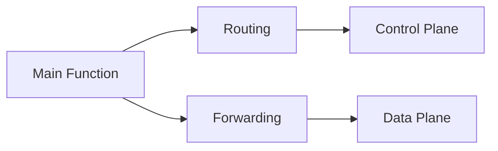
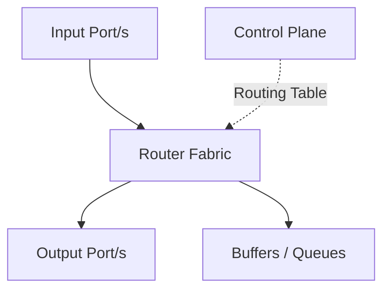

## Core Functions of a Router

- **Main function** → Decide where to send packets  
- **How to choose the best route?**  
- **Name of data** 
	- Message → *Application*
	- Segments → *Transport*
	- Datagram → *Network*
	- Frame → *Data Link*
	- Bits → *Physical*

## Two Main Planes

- **Control Plane**  
	- Responsible for **routing**  
	- Decides the **best route**  
	- Usually **per-router** or **centralized**  

- **Data Plane**  
	- Responsible for **forwarding**  
	- Actually moves packets from input to output  
	- Fast path / per-packet processing  

## Router Architecture Overview

### Key Components Inside the Router

1. **Input Port**  
	- Receives incoming packets  
	- Performs initial lookup

2. **Output Port**  
	- Sends packets out  
	- Handles queuing and transmission

3. **Switching Fabric** (Interconnection)  
	- Bus  
	- Crossbar  
	- Memory (shared memory)

4. **Buffers / Queues**  
	- Very important question:  
		 **How much buffer?**  
	     → Trade-off between packet loss & delay

5. **Scheduling Mechanism**  
	- Decides which packet goes next  
	- (FIFO, Priority, WFQ, etc.)

## Central Questions Highlighted in the Lecture

- How to choose the **best route**?  
- **How much buffer** do we need?  
- Per-router vs **centralized** control  
- Input port ↔ Output port interaction  
- What kind of **fabric** should we use?