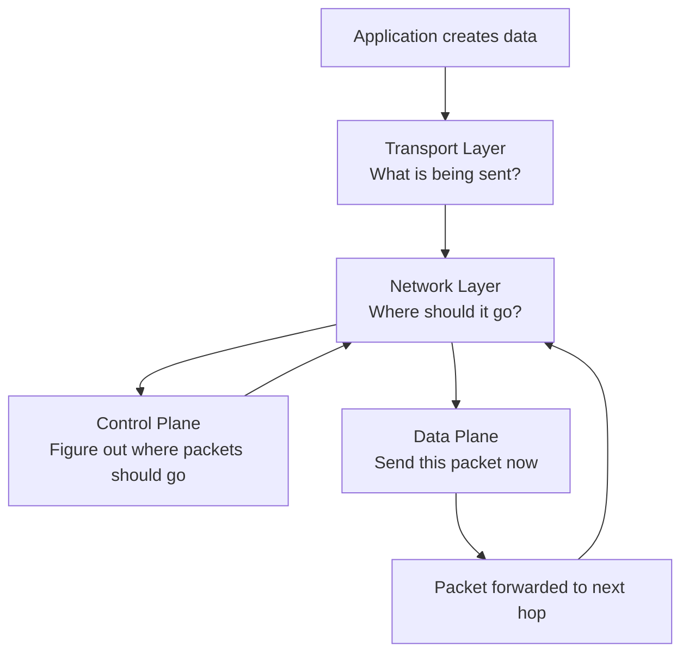

## Introduction – Transport Segment & Network Layer

- **Transport segment** from sending to receiving host
- On **sending side**: transport layer **encapsulates** segments into **datagrams**  
	→ Encapsulation means the segment becomes the **payload** of the IP datagram, and the network layer adds its own header without inspecting the segment contents.
- On **receiving side**: network layer **delivers** segments to transport layer
- The network layer treats transport segments as **opaque data** (independent of TCP/UDP semantics)
- **Network layer protocols** exist in **every host** and **every router**
- **Router** examines **only header fields** in IP datagrams passing through it  
	→ Payload inspection would be expensive and violate layer separation.

## Mental Model

## Network Layer Functions

- **Forwarding**: move packets from router’s input to appropriate router output  
	→ using **data plane**  
	→ local, per-router, extremely fast
- **Routing**: determine route taken by packets from source to destination  
	→ using **control plane**  
	→ global, network-wide, adaptive over time

	

## Data Plane vs Control Plane
> Data plane operates at the **packet timescale** (nanoseconds–microseconds).  
> Control plane operates at the **network-change timescale** (seconds–minutes).

	<table style="width: 100%; border-collapse: collapse; font-family: Arial, sans-serif; background-color: #1e1e2e; color: #e0e0e0; border-radius: 8px; overflow: hidden;">
	  <thead>
	    <tr style="background-color: #36364a; text-align: left;">
	      <th style="padding: 16px 20px; font-weight: bold;">Aspect</th>
	      <th style="padding: 16px 20px; font-weight: bold;">Data Plane</th>
	      <th style="padding: 16px 20px; font-weight: bold;">Control Plane</th>
	    </tr>
	  </thead>
	  <tbody>
	    <tr style="border-bottom: 1px solid #444;">
	      <td style="padding: 16px 20px; font-weight: bold;">Scope</td>
	      <td style="padding: 16px 20px;">Local function</td>
	      <td style="padding: 16px 20px;">Network-wide logic</td>
	    </tr>
	    <tr style="background-color: #252535;">
	      <td style="padding: 16px 20px; font-weight: bold;">Main Responsibility</td>
	      <td style="padding: 16px 20px;">Determines how datagram arriving on router input port is forwarded to router output port <strong>→ Forwarding function</strong></td>
	      <td style="padding: 16px 20px;">Determines how datagram is routed among routers along end-to-end path from source to destination <strong>→ Routing function</strong></td>
	    </tr>
	    <tr style="border-bottom: 1px solid #444;">
	      <td style="padding: 16px 20px; font-weight: bold;">Decision Based On</td>
	      <td style="padding: 16px 20px;">Values in arriving packet header</td>
	      <td style="padding: 16px 20px;">Routing algorithms, topology information, policies</td>
	    </tr>
	    <tr style="background-color: #252535;">
	      <td style="padding: 16px 20px; font-weight: bold;">Performance</td>
	      <td style="padding: 16px 20px;">Per-packet, extremely fast (line rate, hardware-accelerated)</td>
	      <td style="padding: 16px 20px;">Periodic or event-triggered (seconds to minutes)</td>
	    </tr>
	    <tr>
	      <td style="padding: 16px 20px; font-weight: bold;">Control Plane Approaches</td>
	      <td style="padding: 16px 20px;">—</td>
	      <td style="padding: 16px 20px;">
	        <strong>Per-router control plane</strong> (traditional) 
	        <strong>Logically centralized control plane</strong> (SDN)
	      </td>
	    </tr>
	  </tbody>
	</table>

## Per-router Control Plane

Individual routing algorithm components **in each and every router** interact in the control plane.

- Decisions based on **local neighbor exchanges**
- Examples: RIP, OSPF, IS-IS, BGP
- If the control plane temporarily fails, the data plane continues forwarding using the last known tables.

	

## Logically Centralized Control Plane

A distinct (typically remote) **controller** interacts with local **control agents (CAs)**.

> “Logically centralized” means the control logic behaves as one system, even if physically implemented as a distributed cluster.

- Enables global optimization and easier policy enforcement
- Requires reliable controller–router communication

	

